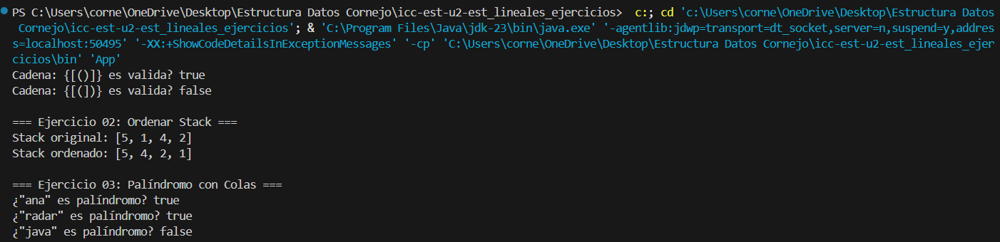
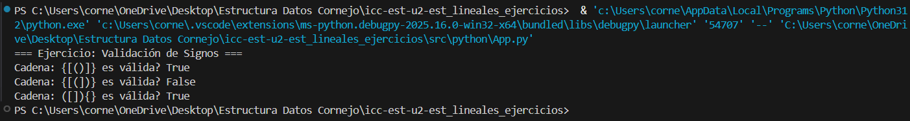

# Práctica de Estructuras de Datos
## Stack y Queue en Java

Nicolas Cornejo

## Ejercicio 01: Validación de Signos

### Descripción
Se verifica si una cadena que contiene los símbolos (), {}, [] está correctamente balanceada.

### Solución
Se utiliza un Stack:
- Los símbolos de apertura se insertan en el stack
- Al encontrar un cierre, se compara con el último símbolo de apertura
- Si no coinciden o el stack está vacío, la cadena es inválida

### Ejemplo de salida
Cadena: {[()]} es válida? true  
Cadena: {[(])} es válida? false  

---

## Ejercicio 02: Ordenar un Stack

### Descripción
Se ordena un Stack de enteros dejando el elemento más pequeño en el tope.

### Solución
- Se utiliza un Stack auxiliar
- Se reinsertan los elementos respetando el orden
- No se usan arreglos ni listas

### Ejemplo de salida
Stack original: [5, 1, 4, 2]  
Stack ordenado: [1, 2, 4, 5]  

---

## Ejercicio 03: Palíndromo usando Colas

### Descripción
Se determina si una palabra es palíndroma usando colas.

### Solución
- Se insertan los caracteres en una cola original
- Se invierte usando una cola auxiliar
- Se comparan ambas colas elemento por elemento

### Ejemplo de salida
"ana" → true  
"radar" → true  
"java" → false  

---

## Evidencias
Ejecuciones en Java

Ejecucion en Python

